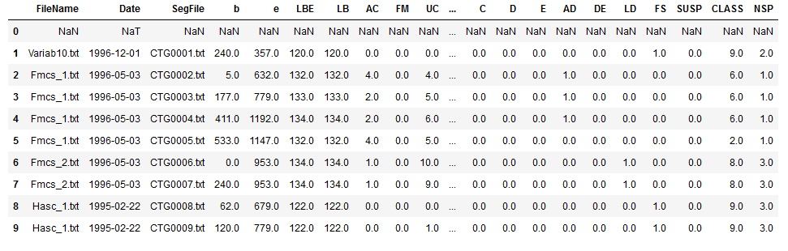

# Cardioctography

### Cardiotocography (CTG) is a technical means of recording the fetal heartbeat and the uterine contractions during pregnancy ,says Google.

  

This notebook provides a classifier to predict the fetal state using **Multiclass Logistic Regression** .

Dataset source : <https://archive.ics.uci.edu/ml/machine-learning-databases/00193/>

Here's a snapshot of 9 records from the  dataset :

The attribute **NSP** is the key attribute for this prediction. NSP is a fetal status class code :
<ul>
<li> N  or 1 -> Normal </li>
<li> S or 2 -> Suspect </li>
<li> P or 3 -> Pathologic </li>
</ul>

    The model gives us a whooping 98.71% accuracy !

